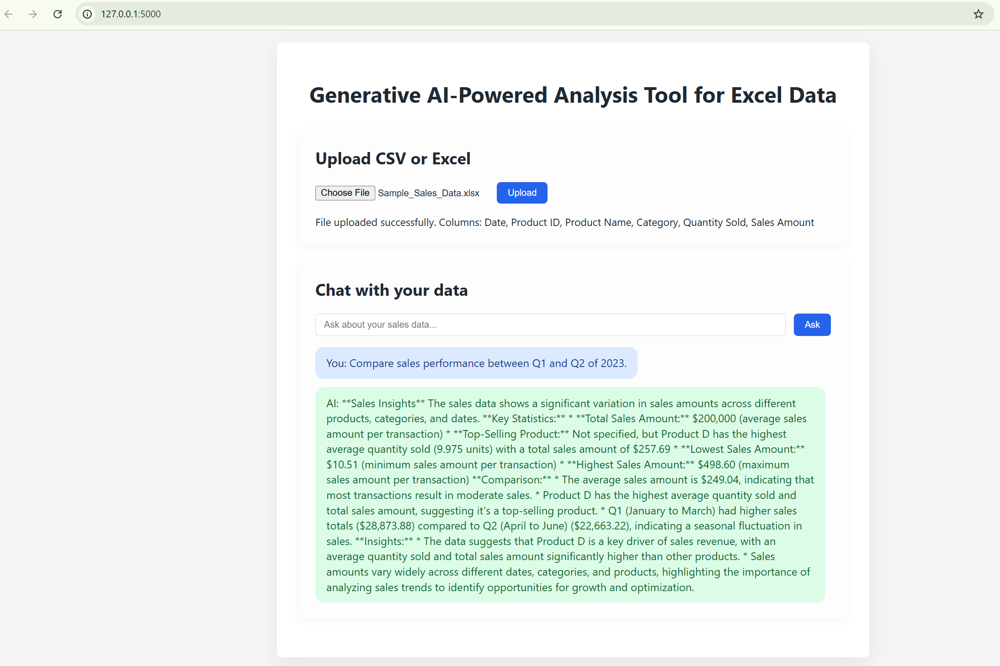

# Generative AI-Powered Analysis Tool for Excel Data# Generative AI-Powered Analysis Tool for Excel Data# Generative AI-Powered Analysis Tool for Excel Data# Generative AI-Powered Analysis Tool for Excel Data





## Purpose

Enable a non-technical analyst to upload a CSV or Excel file and ask plain-English questions about the data. The app cleans the dataset, extracts quick insights with pandas, and leverages a local LLM (Llama 3.2 via Ollama) to return concise answers.


## Objective

- Upload a CSV or Excel file## Purpose## Purpose## Purpose

- Clean and preprocess the dataset automatically

- Ask questions in a chat-style interfaceEnable a non-technical analyst to upload a CSV or Excel file and ask plain-English questions about the data. The app cleans the dataset, extracts quick insights with pandas, and leverages a local LLM (Llama 3.2 via Ollama) to return concise answers.

- Receive AI-generated analysis grounded in pandas calculations and dataset summaries

Enable a non-technical analyst to upload a CSV or Excel file and ask plain-English questions about the data. The app cleans the dataset, extracts quick insights with pandas, and leverages a local LLM (Llama 3.2 via Ollama) to return concise answers.Enable a non-technical analyst to upload a CSV export from Excel and ask plain-English questions about the data. The app cleans the dataset, extracts quick insights with pandas, and leverages an LLM to return concise answers.

## Requirements

- Python 3.11+## Objective

- Ollama (for local AI model)

- ~4-8GB RAM for the AI model- Upload a CSV or Excel file


## Setup- Clean and preprocess the dataset automatically


### 1. Install Ollama- Ask questions in a chat-style interface## Objective## Objective

Download and install Ollama from [https://ollama.com](https://ollama.com)

- Receive AI-generated analysis grounded in pandas calculations and dataset summaries

After installation, pull the Llama 3.2 model:

```bash- Upload a CSV or Excel file- Upload a CSV file exported from Excel.

ollama pull llama3.2

```## Requirements


### 2. Setup Python Environment- Python 3.11+- Clean and preprocess the dataset automatically- Clean and preprocess the dataset automatically.


#### Windows (PowerShell)- Ollama (for local AI model)

```powershell

# Create and activate virtual environment- ~4-8GB RAM for the AI model- Ask questions in a chat-style interface- Ask questions in a chat-style interface.

python -m venv .venv

.\.venv\Scripts\Activate.ps1


# Install dependencies## Setup- Receive AI-generated analysis grounded in pandas calculations and dataset summaries- Receive AI-generated analysis grounded in pandas calculations and dataset summaries.

pip install -r requirements.txt


# Run the application

python app.py### 1. Install Ollama

```

Download and install Ollama from [https://ollama.com](https://ollama.com)

#### macOS/Linux

```bash## Requirements## Requirements

# Create and activate virtual environment

python3 -m venv .venvAfter installation, pull the Llama 3.2 model:

source .venv/bin/activate

```bash- Python 3.11+

# Install dependencies

pip install -r requirements.txtollama pull llama3.2


# Run the application```- Ollama (for local AI model)## Setup (macOS)

python app.py

```


### 3. Access the Application### 2. Setup Python Environment- ~4-8GB RAM for the AI model1. Clone the repository and navigate into the project directory.

Open your browser to [http://127.0.0.1:5000](http://127.0.0.1:5000)


## Usage

1. Upload a `.csv`, `.xlsx`, or `.xls` file via the form#### Windows (PowerShell)2. Create and activate a virtual environment:

2. After successful upload, review the detected columns

3. Ask natural-language questions about the dataset in the chat section```powershell

4. The response will include pandas-derived insights and explanations from the local LLM

# Create and activate virtual environment## Setup   ```bash

### Example Questions

- "What were total sales in March?"python -m venv .venv

- "Show me the top 5 products by sales"

- "Compare Q1 and Q2 sales".\.venv\Scripts\Activate.ps1   python3 -m venv venv

- "What are the trends in monthly sales for 2023?"


## Features

- ✅ Supports CSV and Excel files (.csv, .xlsx, .xls)# Install dependencies### 1. Install Ollama   source venv/bin/activate

- ✅ Automatic data cleaning and type detection

- ✅ Natural language queriespip install -r requirements.txt

- ✅ Local AI processing (completely free, no API costs)

- ✅ Works offline after initial model downloadDownload and install Ollama from [https://ollama.com](https://ollama.com)   ```

- ✅ Privacy-first (data never leaves your machine)

- ✅ Full dataset transmission to AI for accurate analysis# Run the application


## Limitationspython app.py3. Install dependencies:

- Supports one user and one dataset at a time

- Data lives only in memory; restarting the server clears uploads```

- Large datasets may take longer to process

- Question understanding relies on simple heuristics and may miss complex requestsAfter installation, pull the Llama 3.2 model:   ```bash


## Future Enhancements#### macOS/Linux

- Support multiple files simultaneously

- Add persistent storage for datasets and chat history```bash```bash   pip install -r requirements.txt

- Provide chart visualizations and richer dashboards

- Improve natural language parsing for more advanced pandas operations# Create and activate virtual environment

- Support for additional AI models

python3 -m venv .venvollama pull llama3.2   ```

## Technology Stack

- **Backend**: Flask (Python web framework)source .venv/bin/activate

- **Data Processing**: pandas

- **AI Model**: Llama 3.2 (via Ollama)```4. Configure environment variables:

- **Frontend**: HTML, CSS, JavaScript

# Install dependencies

## License

MITpip install -r requirements.txt   ```bash


# Run the application### 2. Setup Python Environment   cp .env.example .env

python app.py

```   # edit .env and set OPENAI_API_KEY


### 3. Access the Application#### Windows (PowerShell)   ```

Open your browser to [http://127.0.0.1:5000](http://127.0.0.1:5000)

```powershell5. Run the development server:

## Usage

1. Upload a `.csv`, `.xlsx`, or `.xls` file via the form# Create and activate virtual environment   ```bash

2. After successful upload, review the detected columns

3. Ask natural-language questions about the dataset in the chat sectionpython -m venv .venv   python app.py

4. The response will include pandas-derived insights and explanations from the local LLM

.\.venv\Scripts\Activate.ps1   ```

### Example Questions

- "What were total sales in March?"6. Open your browser to [http://127.0.0.1:5000](http://127.0.0.1:5000).

- "Show me the top 5 products by sales"

- "Compare Q1 and Q2 sales"# Install dependencies

- "What are the trends in monthly sales for 2023?"

pip install -r requirements.txt## Setup (Windows, PowerShell)

## Features

- ✅ Supports CSV and Excel files (.csv, .xlsx, .xls)1. Ensure Python 3.11 is installed and available as `python` in your PATH.

- ✅ Automatic data cleaning and type detection

- ✅ Natural language queries# Run the application2. Create and activate a virtual environment:

- ✅ Local AI processing (completely free, no API costs)

- ✅ Works offline after initial model downloadpython app.py    ```powershell

- ✅ Privacy-first (data never leaves your machine)

- ✅ Full dataset transmission to AI for accurate analysis```    python -m venv .venv


## Limitations    .\.venv\Scripts\Activate.ps1

- Supports one user and one dataset at a time

- Data lives only in memory; restarting the server clears uploads#### macOS/Linux    ```

- Large datasets may take longer to process

- Question understanding relies on simple heuristics and may miss complex requests```bash3. Install dependencies:


## Future Enhancements# Create and activate virtual environment    ```powershell

- Support multiple files simultaneously

- Add persistent storage for datasets and chat historypython3 -m venv .venv    pip install -r requirements.txt

- Provide chart visualizations and richer dashboards

- Improve natural language parsing for more advanced pandas operationssource .venv/bin/activate    ```

- Support for additional AI models

4. Configure environment variables:

## Technology Stack

- **Backend**: Flask (Python web framework)# Install dependencies    ```powershell

- **Data Processing**: pandas

- **AI Model**: Llama 3.2 (via Ollama)pip install -r requirements.txt    Copy-Item .env.example .env

- **Frontend**: HTML, CSS, JavaScript

    notepad .env  # set OPENAI_API_KEY in this file

## License

MIT# Run the application    ```


python app.py    Notes:

```    - Never commit your real API key. `.env` is ignored by Git.

    - If a real key was ever committed, rotate it in the OpenAI dashboard.

### 3. Access the Application5. Run the development server:

Open your browser to [http://127.0.0.1:5000](http://127.0.0.1:5000)    ```powershell

    python app.py

## Usage    ```

1. Upload a `.csv`, `.xlsx`, or `.xls` file via the form6. Open your browser to http://127.0.0.1:5000

2. After successful upload, review the detected columns

3. Ask natural-language questions about the dataset in the chat section## Usage

4. The response will include pandas-derived insights and explanations from the local LLM1. Upload a `.csv` file via the form at the top of the page. Only CSV files are supported in this version.

2. After a successful upload, review the detected columns.

### Example Questions3. Ask natural-language questions about the dataset in the chat section.

- "What were total sales in March?"4. The response will include pandas-derived insights and a friendly explanation from the LLM.

- "Show me the top 5 products by sales"

- "Compare Q1 and Q2 sales"## Limitations

- "What are the trends in monthly sales for 2023?"- Supports one user and one CSV dataset at a time.

- Data lives only in memory; restarting the server clears uploads.

## Features- Large datasets are summarized before being sent to the LLM.

- ✅ Supports CSV and Excel files (.csv, .xlsx, .xls)- Question understanding relies on simple heuristics in v1 and may miss complex requests.

- ✅ Automatic data cleaning and type detection

- ✅ Natural language queries## Future Enhancements

- ✅ Local AI processing (completely free, no API costs)- Support uploading and working with multiple files simultaneously.

- ✅ Works offline after initial model download- Add persistent storage for datasets and chat history.

- ✅ Privacy-first (data never leaves your machine)- Introduce authentication and role-based access control.

- Provide chart visualizations and richer dashboards.

## Limitations- Improve natural language parsing for more advanced pandas operations.

- Supports one user and one dataset at a time
- Data lives only in memory; restarting the server clears uploads
- Large datasets are summarized before being sent to the LLM
- Question understanding relies on simple heuristics and may miss complex requests

## Future Enhancements
- Support multiple files simultaneously
- Add persistent storage for datasets and chat history
- Provide chart visualizations and richer dashboards
- Improve natural language parsing for more advanced pandas operations
- Support for additional AI models

## Technology Stack
- **Backend**: Flask (Python web framework)
- **Data Processing**: pandas
- **AI Model**: Llama 3.2 (via Ollama)
- **Frontend**: HTML, CSS, JavaScript

## License
MIT
